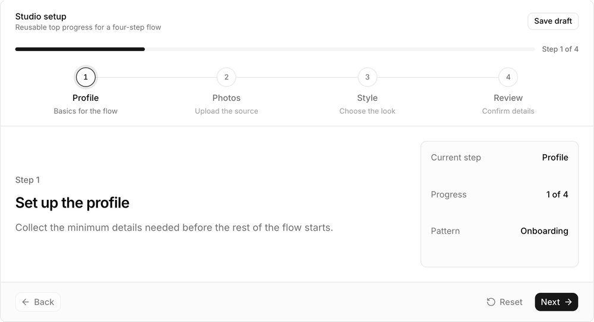
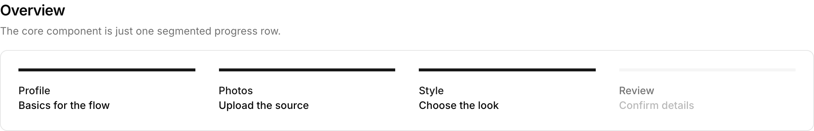
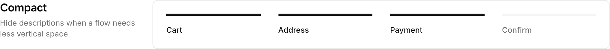
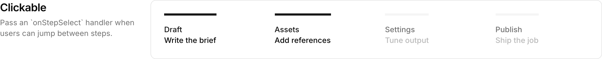

# Steps

A segmented steps navigation component for showing where someone is in a multi-step process.

## Preview









## Installation

```bash
npx shadcn@latest add https://raw.githubusercontent.com/addisonk/steps/main/public/r/steps.json
```

## Usage

```tsx
import { Steps } from "@/components/custom-ui/steps"

const steps = [
  { id: "basic-info", title: "Step 1", description: "Basic info and Selfie" },
  { id: "photo-pack", title: "Step 2", description: "Photo pack selection" },
  { id: "upload-photos", title: "Step 3", description: "Upload photos" },
  { id: "review", title: "Step 4", description: "Review & submit" },
]

<Steps steps={steps} currentStep="photo-pack" />
```

### Clickable steps

```tsx
const [currentStep, setCurrentStep] = React.useState("photo-pack")

<Steps
  steps={steps}
  currentStep={currentStep}
  onStepSelect={(step) => setCurrentStep(String(step.id))}
/>
```

### Compact

```tsx
<Steps
  steps={steps}
  currentStep="upload-photos"
  showDescriptions={false}
/>
```

## Props

| Prop | Description |
|------|-------------|
| `steps` | Array of steps with `id`, `title`, optional `description`, optional `href`, optional `status`, and optional `disabled`. |
| `currentStep` | Current step id. |
| `currentStepIndex` | Current step index. Useful when ids are not available. |
| `onStepSelect` | Optional callback that makes steps interactive. |
| `showDescriptions` | Show or hide step descriptions. |

## License

MIT
